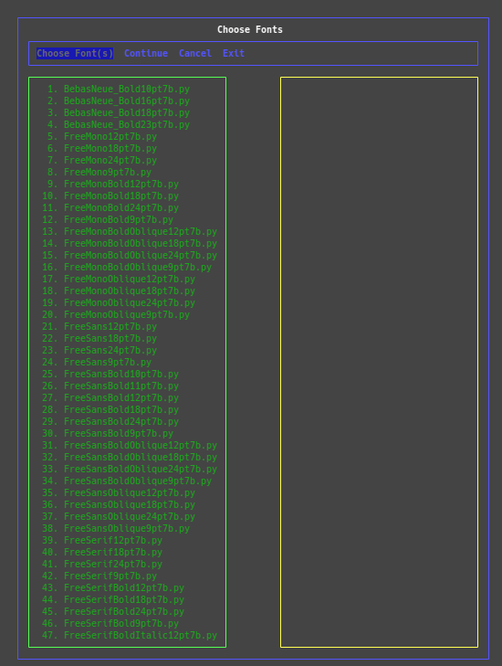

**********
Python-TFT
**********

Use Python to connect to TFT LCD displays.

The Python-TFT API will work with versions of python 3.5 and higher MicroPython
and CircuitPython are based on the 3.5 C standard version of Python. On a
Raspberry Pi it is best to use Python 3.8 or 3.9 at the time of this writing.

.. attention::
   As of now CircuitPython on all the boards that I have tested does not work.
   There is an issue with blowing out the stack (RuntimeError: pystack
   exhausted). All the suggestions I have found recommended to recompile
   CircuitPython with a larger stack size. I cannot expect my users to do this
   nor will I try to do it myself. As of now my code will not work at all with
   CircuitPython. I'm leaving all the CircuitPython code in my API with the
   hopes that Adafruit will fix this issue on their own. Please try it yourself
   and let me know what you find. Thanks

Building Packages
=================

There is no way to provide a build for all compute devices, so you will need
to build your own package. Follow the instructions below on building for your
device. Though it is not necessary to build a package for a Raspberry Pi it
is better to build one because the path to the modules is flattened and will
be consistent with devices that run MicroPython and CircuitPython.

Installing Python 3.9
---------------------

First off, though the API itself will work with versions of Python 3.5 and
higher the tests and the build script will only run with versions of Python 3.8
and 3.9, lower and higher versions do not work properly. This is mostly due to
third-party packages not Python-TFT itself. So you may need to install another
version before you go further. This will most likely be necessary if you are
building on a Raspberry PI. Follow the instructions below to install version
3.9 of Python.

First update and install a few system packages.

.. code-block:: console

  $ sudo apt update && apt upgrade
  $ sudo apt install libssl-dev cargo libsqlite3-dev ncurses-bin \
                     ncurses-base libncurses5-dev

I usually create a directory named **src** in my user directory. Assuming you
also do the same cd into that directory then execute the commands below.

.. code-block:: console

   $ wget https://www.python.org/ftp/python/3.9.14/Python-3.9.14.tar.xz
   $ tar -xJvf Python-3.9.14.tar.xz
   $ cd Python-3.9.14/
   $ ./configure --enable-optimizations --enable-loadable-sqlite-extensions=yes
   $ sudo make altinstall

With the **altinstall** target in the Makefile Python will be installed in
the **/usr/local** path. As of this writing Python-3.10.4 does not work with
**nosetests** however the build script may work.

Build Platform Packages
-----------------------

Building packages for a Raspberry Pi is not absolutely necessary since the
size of the whole git repository is not very much for a RPi. You can build
it if you want which can get you a much smaller package and also make the
package tree the same as all other packages. Keep in mind that building
packages on any platform will flatten the file tree under the TFT chip type
that you are using. All packages will look more or less the same. Note that
the directory tree below is for a MicroPython package and the font files are
just examples.

.. code-block:: console

   .
   └── ILI9225
       ├── common.py
       ├── compatibility.py
       ├── default_fonts.py
       ├── fonts
       │   ├── BebasNeue_Bold10pt7b.py
       │   ├── FreeMonoBoldOblique12pt7b.py
       │   ├── __init__.py
       │   ├── Org_01.py
       │   └── TomThumb.py
       ├── ili9225.py
       ├── __init__.py
       └── micropython.py

Below is the basic usage of the package creation script.

.. code-block:: console

   $ ./scripts/create_packages.py --help
   usage: create_packages.py [-h] [-a] [-c] [-p] [-m] [-r] [-2] [-3] [-f] [-s] [-F] [-L] [-C arch-type] [-O opt-level] [-D] [-N]

   Creating packages...

   optional arguments:
     -h, --help           show this help message and exit
     -a, --all            Create all packages.
     -c, --circuitpython  Create a CircuitPython package.
     -p, --computer       Create a Computer package.
     -m, --micropython    Create a MicroPython package.
     -r, --raspi          Create a Raspberry Pi package.
     -2, --ili9225        Create a ILI9225 package.
     -3, --ili9341        Create a ILI9341 package.
     -f, --fonts          Choose which fonts to put in the final packages.
     -s, --strip          Strip comments and non-code white space on the
                          MicroPython and CircuitPython packages.
     -F, --force-strip    Force striping on all packages including the
                          Raspberry Pi and Computer packages.
     -L, --list-compress  List cross compile architecture types.
     -C arch-type, --compress arch-type
                          Enter the number of the cross compile architecture type.
     -O opt-level, --opt-level opt-level
                          Enter the optimization level for the cross compiler.
     -D, --debug          Run in debug mode.
     -N, --noop           Run as if creating, but do nothing.

For both MicroPython and CircuitPython you will need to determine the
architecture type, this is no easy task as the types used by **mpy-cross**
are somewhat cryptic, trial and error is the only way I have determined the
correct type. If in doubt just use 0 (zero). To find the available types run
the command below.

.. code-block:: bash

   $ ./scripts/create_packages.py -L

Building a package for MicroPython would look similar to the following. The
package will be built for the ``ILI9225`` chip. The curses screen will appear
so that you can choose the fonts you want. The build process will remove all
doc strings, comments, and extra line-feeds to save space on the MCU.

.. code-block:: bash

   $ ./scripts/create_packages.py -m2fsC10 # ESP32

If you will be building for a CircuitPython device the process is a little
more involved. This is because the **mpy-cross** app that Adafruit provides here
`mpy-cross Download <https://adafruit-circuit-python.s3.amazonaws.com/index.html?prefix=bin/mpy-cross/>`_
has the same name as the MicroPython application and will overwrite it. Because
of this the Adafruit version needs to be renamed to **mpy-cross-cp** and copied
into the virtual environment bin directory. You will need to pick the latest
one for your development environment. You may also want to update the version
of CircuitPython on your device for things to work properly.

.. code-block:: bash

   $ ./scripts/create_packages.py -c2sC0 # XIAO-RP2040

If you use the **-f** option you will be confronted by a curses terminal
screen. The mouse will work in the terminal. Without the **-f** option no GFX
fonts will be included in your package.

 1. Click the left mouse button or press the Enter key on the **Choose Font(s)**
    button. This will let the mouse work in the left window. The mouse wheel
    can be used to scroll up and down the font files if there are more than
    what can fit on the screen.
 2. The left mouse button is used to choose the fonts you want in your package.
 3. Clicking twice on the **Continue** button will continue with building your
    package.
 4. If you have chosen the wrong packages and want to start over click twice
    on the **Cancel** button and start over again.
 5. If you want to just exit the whole process click twice on the **Exit**
    button.

The "click twice" mentioned above is needed as the first click gets you out of
the left window. Note that the left and right keys also can be used to navigate
the main menu.

Uploading Packages
==================

Be sure you are in the root directory of the git repository of this API.
The instructions below are guaranteed to work on an Ubuntu derived OS.

Raspberry Pi
------------

On a Raspberry PI you can either build a custom package or just checkout
this repository to your RPi. A built package will work better in a python
virtual environment because it can be copied directly into the VE much easier.

MicroPython
-----------

Create your package as describe above. Your device may be different than the
one I used. If you type **ampy** with no arguments you will get a list of the
commands  **ampy** provides. You may need to press the reset button on your
device between runs of **ampy**.

.. code-block:: bash

   $ cd build/micropython/
   $ ampy -p /dev/ttyUSB0 put ILI9225

CircuitPython
-------------

Create your package as describe above.

.. code-block:: bash

   $ cd build/circuitpython
   $ cp ILI9225 /media/<user>/CIRCUITPY/lib/
   $ touch /media/<user>/CIRCUITPY/lib/__init__.py

Running Unit Tests
==================

Assuming you are using the SPI port 0 put a jumper between the MOSI (GPIO 10)
and MISO (GPIO 9). It is best to wire this up on a breadboard. Do NOT have
the TFT plugged into the breadboard at the same time you are running tests.

All tests are run with the nose tool.

Full Tests
----------

Full tests can be run with the following make target:

.. code-block:: bash

   $ make rpi-tests

This command will run all tests and when it's done coverage will be
displayed. A few tests pass based on precise timing between different
operations measured between the hardware and software. These tests
periodically fail when the Raspberry Pi seems to be under a heaver load
than normal. Just run the tests a few time and you may want to wait some
time between runs.

Partial Tests
-------------

There is a special script at the root of the project that should be used to
run partial tests. These tests can be run in a few different ways based on
how the nose tool works. Notice that these are all dot separated paths and
the : (Colon) before the class name.

.. code-block:: bash

   $ ./run_test.sh py_versions.tests.test_raspberrypi

In the above all tests will be run in the ``test_raspberrypi.py`` module.

.. code-block:: bash

   $ ./run_test.sh ILI9225.tests.test_ili9225:TestILI9225

In the above all tests will be run in the ``TestILI9225`` class from the
``test_ili9225.py`` module.

.. code-block:: bash

   $ ./run_test.sh ILI9225.tests.test_ili9225:TestILI9225.test__set_window

In the above only one test method ``test__set_window`` in the ``TestILI9225``
class.
